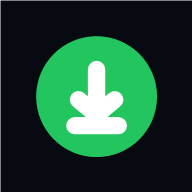
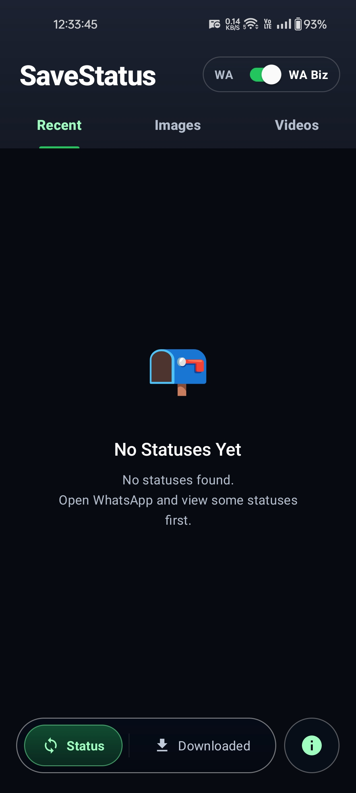
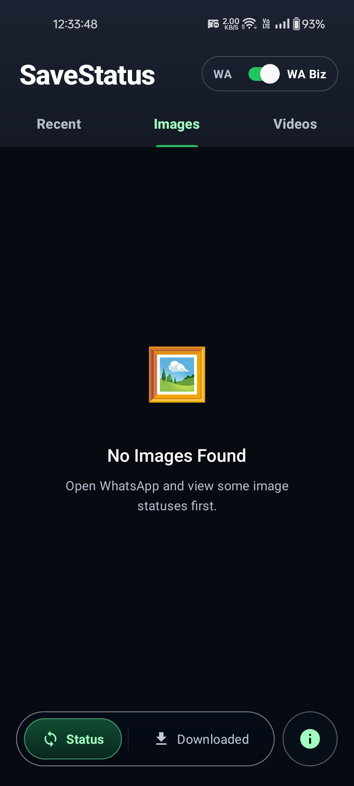
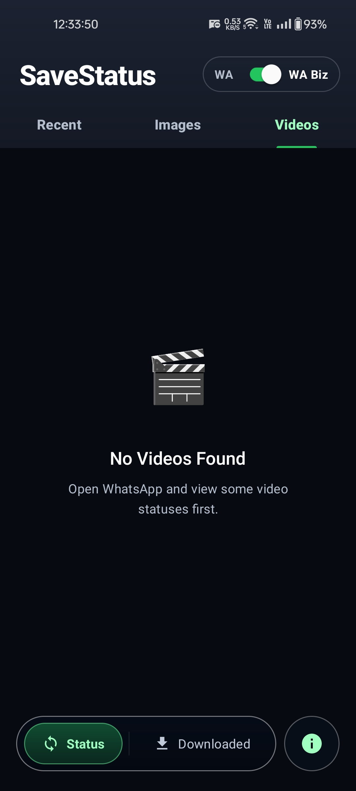
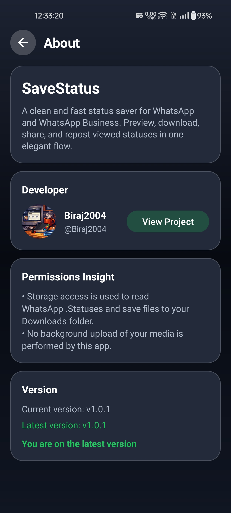

<h1 align="center">SaveStatus PRO</h1>

<p align="center">
  
</p>

<p align="center">
  <strong>Modern Android status saver for WhatsApp and WhatsApp Business</strong>
</p>

<p align="center">
  Browse statuses | Download to local storage | Share instantly | Check latest releases
</p>

<p align="center">
  <a href="https://github.com/Biraj2004/SaveStatus-PRO/releases/latest"></a>
  <a href="https://github.com/Biraj2004/SaveStatus-PRO/issues"></a>
  
  
  
  
</p>

<p align="center">
  <a href="https://github.com/Biraj2004/SaveStatus-PRO/releases/latest"></a>
  <a href="https://github.com/Biraj2004/SaveStatus-PRO/issues/new"></a>
  <a href="https://github.com/Biraj2004/SaveStatus-PRO/releases"></a>
</p>

SaveStatus PRO is a clean and performance-focused Android app for viewing and saving WhatsApp and WhatsApp Business statuses, with a native media experience and streamlined release workflow.

## Table of Contents

1. [Features](#features)
2. [Screenshots](#screenshots)
3. [Tech Stack](#tech-stack)
4. [Project Structure](#project-structure)
5. [Getting Started](#getting-started)
6. [Build and Export APK](#build-and-export-apk)
7. [Release Process](#release-process)
8. [Permissions and Privacy](#permissions-and-privacy)
9. [Troubleshooting](#troubleshooting)
10. [Maintainer](#maintainer)

## Features

- Browse statuses in dedicated tabs: Recent, Images, Videos
- Toggle source between WhatsApp (WA) and WhatsApp Business (WA Biz)
- Save status media into organized Downloads folders
- View downloaded content in a dedicated section
- Native video player for status videos with play/pause, seek bar, and time controls
- Full-screen image viewer with zoom/pan plus download and share actions
- About screen with current version and latest release check
- Lightweight and responsive Android UI

## Screenshots

<table>
  <tr>
    <td align="center"><strong>Recent</strong></td>
    <td align="center"><strong>Images</strong></td>
    <td align="center"><strong>Videos</strong></td>
    <td align="center"><strong>About</strong></td>
  </tr>
  <tr>
    <td align="center"></td>
    <td align="center"></td>
    <td align="center"></td>
    <td align="center"></td>
  </tr>
</table>

## Tech Stack

<p>
  
  
  
  
</p>
<p>
  
  
  
  
</p>

- Language: Kotlin
- UI: Android Views (XML), Material Components
- Architecture: Activity + Fragments + ViewModel + Repository
- Async: Kotlin Coroutines
- Image loading: Glide
- Video playback: Media3 ExoPlayer
- Build system: Gradle Kotlin DSL
- Android SDK levels:
  - Min SDK: 21
  - Target SDK: 34
  - Compile SDK: 34

## Project Structure

```text
app/
  src/main/java/com/savestatus/pro/
    adapter/
    data/
    model/
    player/
    ui/
    utils/
  src/main/res/
APK_Export/                  # Exported release APK artifacts
```

## Getting Started

### Prerequisites

- Android Studio (latest stable recommended)
- JDK 17
- Android SDK 34

### Clone

```bash
git clone https://github.com/Biraj2004/SaveStatus-PRO.git
cd SaveStatus-PRO
```

### Run debug build

```bat
gradlew.bat assembleDebug
```

Then run the app from Android Studio on a physical device or emulator.

## Build and Export APK

### 1) Configure signing

Create a `keystore.properties` file in project root:

```properties
storeFile=path/to/your.keystore
storePassword=YOUR_STORE_PASSWORD
keyAlias=YOUR_KEY_ALIAS
keyPassword=YOUR_KEY_PASSWORD
```

### 2) Build and export

```bat
gradlew.bat exportApk
```

Exported APK path format:

- `APK_Export/SaveStatus_PRO_v<versionName>.apk`

For current source version:

- `APK_Export/SaveStatus_PRO_v1.0.1.apk`

## Release Process

1. Update app version in `app/build.gradle.kts`:
   - Increase `versionCode`
   - Set `versionName` (semantic versioning)
2. Build and export APK with `gradlew.bat exportApk`
3. Commit and push changes
4. Create a GitHub release:
   - Tag: `v<versionName>`
   - Target: `main`
   - Title: `SaveStatus PRO v<versionName>`
   - Upload APK from `APK_Export`

Version consistency checklist:

- `versionName` in `app/build.gradle.kts`
- Release tag name
- APK filename
- About screen version display

## Permissions and Privacy

### Storage permission model

- Android 8-9:
  - `READ_EXTERNAL_STORAGE`
  - `WRITE_EXTERNAL_STORAGE`
- Android 10:
  - `READ_EXTERNAL_STORAGE`
- Android 11+:
  - `MANAGE_EXTERNAL_STORAGE` (All files access)

### Other permissions

- `INTERNET` (for About screen release check)
- `SET_WALLPAPER`

### Privacy notes

- Media processing is local on device
- Saved files are written to Downloads:
  - `SaveStatus PRO/SaveStatus Images`
  - `SaveStatus PRO/SaveStatus Videos`
- No background upload of user media is performed by app logic

## Troubleshooting

### Release build fails due to signing config

- Ensure `keystore.properties` exists with all required keys:
  - `storeFile`
  - `storePassword`
  - `keyAlias`
  - `keyPassword`

### No statuses found

- Open WhatsApp and view some statuses first
- Verify WA or WA Biz mode is selected correctly
- Re-check storage permission state

### Android 11+ cannot access statuses

- Grant "All files access" to the app in settings

### About screen shows "Latest version: Not published yet"

- Publish at least one GitHub release with tag format like `v1.0.1`
- Confirm internet connectivity on device

## Maintainer

- Owner: Biraj2004
- Repository: https://github.com/Biraj2004/SaveStatus-PRO
